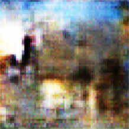

# Deep Learning Architectures for Building Architecture

**Title:** Building Deep Learning Architectures to Understand Building Architecture Styles
**Authors:** Caroline Ho & Cole Thomson {cho19, colet}@stanford.edu
**Course:** CS 230 – Deep Learning

## Requirements

- PyTorch and libraries: [Anaconda Python distribution](https://www.anaconda.com)
- Dataset: [Xu et al. 25-class architecture dataset](https://drive.google.com/file/d/0Bwo0SFiZwl3JVGRlWGZUaW5va00/edit)

### classify.ipynb

- Install [tabulate](https://pypi.org/project/tabulate/): `pip install tabulate`
- Install [TNT](https://github.com/pytorch/tnt): `pip install torchnet`

## Description

### classify.ipynb

This notebook uses transfer learning to classify images of buildings by architectural style.

**Best Results:** After pretraining a DenseNet on ImageNet, we achieve an accuracy of **0.795833** and a F1 score of **0.789431**. (Visualizations available in notebook.)

### generate.ipynb

This notebook generates images of buildings conditioned on architecture styles using a conditional GAN.

**Results after 20 epochs:**

Our most successful generated image is this example of Ancient Egyptian architecture, which is visibly a pyramid:

However, most of our images, including this example of American Craftsman architecture, fall short of the mark.

## Acknowledgments

Much of our code has been adapted from the following sources.

- Data: [Architectural Style Classification using MLLR](https://sites.google.com/site/zhexuutssjtu/projects/arch)
- Classification: [PyTorch Transfer Learning Tutorial](https://pytorch.org/tutorials/beginner/transfer_learning_tutorial.html) and [Finetuning Torchvision Models Tutorial](https://pytorch.org/tutorials/beginner/finetuning_torchvision_models_tutorial.html)
- Confusion Matrix: [scikit-learn](https://scikit-learn.org/stable/auto_examples/model_selection/plot_confusion_matrix.html)
- Conditional GAN: [togheppi's cDCGAN](https://github.com/togheppi/cDCGAN)